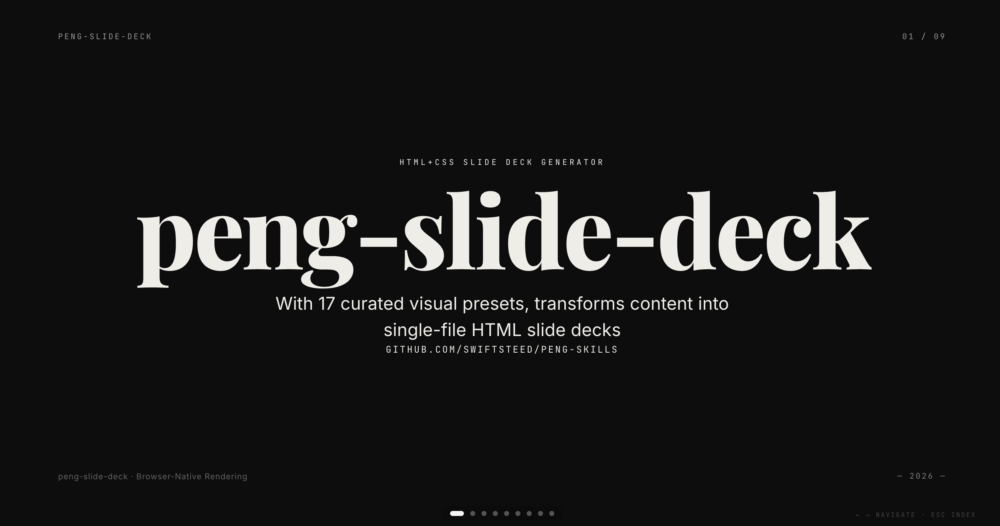

<div align="center">

# peng-skills

**AI Agent Skills for Content Creation**

A collection of skills for content creation workflows.

[English](./README.md) · [中文](./README.zh-CN.md)

</div>

---

## Skills

| Skill | Description |
|-------|-------------|
| [peng-slide-deck](./peng-slide-deck/SKILL.md) | HTML+CSS slide deck generator — 17 curated visual presets (customizable across texture, color, typography, density), 8-step reviewable pipeline |

## Quick Start

```bash
git clone https://github.com/SwiftSteed/peng-skills.git
ln -sf $(pwd)/peng-skills/peng-slide-deck ~/.claude/skills/peng-slide-deck
```

## peng-slide-deck

> [!NOTE]
> Forked from [baoyu-slide-deck](https://github.com/JimLiu/baoyu-skills) by [JimLiu](https://github.com/JimLiu). Replaces image generation with pure HTML+CSS output — same curated visual presets and reviewable pipeline, browser-native rendering.
>
> Color theme system and Motion One animation engine adapted from [guizang-ppt-skill](https://github.com/op7418/guizang-ppt-skill) by [op7418](https://github.com/op7418).

Transform content into a single-file HTML slide deck — no image generation backend, no PPT tooling, just open in a browser and present.

### Usage

```bash
# From markdown file
/peng-slide-deck path/to/article.md

# With style and audience
/peng-slide-deck path/to/article.md --style corporate
/peng-slide-deck path/to/article.md --audience executives

# Target slide count
/peng-slide-deck path/to/article.md --slides 15

# Outline only (no HTML generation)
/peng-slide-deck path/to/article.md --outline-only

# With language and theme
/peng-slide-deck path/to/article.md --lang zh --theme indigo
```

### Options

| Option | Description |
|--------|-------------|
| `--style <name>` | Visual style: preset name or `custom` |
| `--audience <type>` | Target: beginners, intermediate, experts, executives, general |
| `--lang <code>` | Output language (en, zh, ja, etc.) |
| `--slides <N>` | Target slide count (8-25 recommended, max 30) |
| `--outline-only` | Generate outline only, skip HTML |
| `--html-only` | Generate HTML only, skip review |
| `--theme <name>` | Color theme: ink, indigo, forest, kraft, dune |

### Live Demo

Try it in your browser — full WebGL backgrounds, page transitions, and animations:

→ **[Live Demo](https://swiftsteed.github.io/peng-skills/demo/index-en.html)** ←



### Key Features

- **17 curated visual presets**: blueprint, corporate, minimal, sketch-notes, bold-editorial, vintage, and more — auto-recommended from content keywords, freely customizable across texture, color, typography, and density
- **17 curated presets**: blueprint, corporate, minimal, sketch-notes, bold-editorial, vintage, and more — auto-selected from content keywords
- **8-step reviewable pipeline**: analyze → confirm → outline → review → generate HTML → review → preview → ship
- **Font safety**: Google Fonts (SIL OFL) → Apple system fonts → CSS generic fallbacks — zero copyright risk
- **Self-contained output**: single HTML file with WebGL backgrounds, keyboard/wheel/touch navigation, ESC overview, and offline Motion One animations
- **Print to PDF**: Cmd+P directly in browser

## License

This project is licensed under the [MIT License](./LICENSE).
