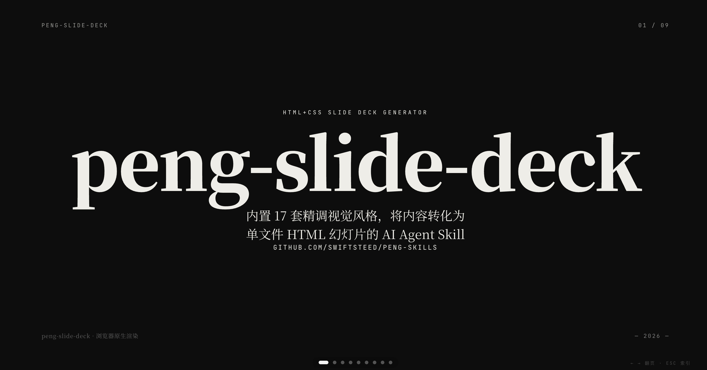

<div align="center">

# peng-skills

**AI Agent Skills for Content Creation**

内容创作 skill 合集。

[English](./README.md) · [中文](./README.zh-CN.md)

</div>

---

## Skill 列表

| Skill | 简介 |
|------|------|
| [peng-slide-deck](./peng-slide-deck/SKILL.md) | HTML+CSS 幻灯片生成器 — 17 套精调视觉风格（纹理×色彩×字体×密度可自由组合）、8 步流水线 |
| [peng-image-cards](./peng-image-cards/SKILL.md) | HTML+CSS 竖屏卡片生成器 — 12 风格 × 8 布局 × 3 配色，输出为可滚动网页。适用于公众号排版、邮件、网页嵌入 |
| [peng-cover-image](./peng-cover-image/SKILL.md) | HTML+CSS 文章封面生成器 — 6 种构图 × 11 套配色 × 7 种渲染 × 4 级文字。浏览器预览，截图即社交分享图 |
| [peng-infographic](./peng-infographic/SKILL.md) | HTML+CSS 信息图生成器 — 20+ 布局 × 21 风格，高密度数据可视化。浏览器预览，截图或嵌入网页 |

## 快速开始

```bash
git clone https://github.com/SwiftSteed/peng-skills.git
ln -sf $(pwd)/peng-skills/peng-slide-deck ~/.claude/skills/peng-slide-deck
```

## peng-slide-deck

> [!NOTE]
> 基于 [JimLiu](https://github.com/JimLiu) 的 [baoyu-slide-deck](https://github.com/JimLiu/baoyu-skills)。将生图换成纯 HTML+CSS 输出——保留视觉风格系统和流水线，用浏览器原生渲染。
>
> 主题色系统和 Motion One 动效引擎源自 [op7418](https://github.com/op7418) 的 [guizang-ppt-skill](https://github.com/op7418/guizang-ppt-skill)。

将内容转化为单文件 HTML 幻灯片——无需生图后端、无需 PPT 工具，浏览器打开即用。

### 用法

```bash
# 从 markdown 文件
/peng-slide-deck path/to/article.md

# 指定风格和受众
/peng-slide-deck path/to/article.md --style corporate
/peng-slide-deck path/to/article.md --audience executives

# 目标页数
/peng-slide-deck path/to/article.md --slides 15

# 仅生成大纲（不生成 HTML）
/peng-slide-deck path/to/article.md --outline-only

# 指定语言和主题色
/peng-slide-deck path/to/article.md --lang zh --theme indigo
```

### 选项

| 选项 | 描述 |
|------|------|
| `--style <name>` | 视觉风格：预设名或 `custom` |
| `--audience <type>` | 受众：beginners, intermediate, experts, executives, general |
| `--lang <code>` | 输出语言（en, zh, ja 等） |
| `--slides <N>` | 目标页数（推荐 8-25，最大 30） |
| `--outline-only` | 仅生成大纲，跳过 HTML |
| `--html-only` | 仅生成 HTML，跳过审查 |
| `--theme <name>` | 主题色：ink, indigo, forest, kraft, dune |

### 在线演示

在浏览器中体验完整效果——WebGL 背景、翻页动效、入场动画：

→ **[在线演示](https://swiftsteed.github.io/peng-skills/demo/index.html)** ←



### 核心特性

- **17 套精调视觉风格**：blueprint、corporate、minimal、sketch-notes 等——根据内容关键词自动推荐，纹理、色彩、字体、密度可按需调节
- **17 个精调预设**：blueprint、corporate、minimal、sketch-notes、bold-editorial、vintage 等——根据内容关键词自动推荐
- **8 步流水线**：分析 → 确认 → 大纲 → 审查 → 生成 HTML → 审查 → 预览 → 交付
- **字体零版权风险**：Google Fonts (SIL OFL) → Apple 系统字体 → CSS 通用族名
- **自包含输出**：单 HTML 文件，含 WebGL 背景、键盘/滚轮/触屏翻页、ESC 索引视图、离线 Motion One 动效
- **直接打印 PDF**：浏览器内 Cmd+P

## peng-image-cards

> [!NOTE]
> 基于 [JimLiu](https://github.com/JimLiu) 的 [baoyu-image-cards](https://github.com/JimLiu/baoyu-skills#baoyu-image-cards)。将生图换成纯 HTML+CSS 输出——保留 12 风格 × 8 布局 × 3 配色系统，用浏览器原生渲染。

将内容转化为竖屏卡片单文件 HTML——上下滚动浏览，适配手机屏幕，适用于公众号排版、邮件营销、网页嵌入。

### 用法

```bash
/peng-image-cards path/to/content.md
/peng-image-cards path/to/content.md --preset knowledge-card
/peng-image-cards path/to/content.md --style notion --layout dense
/peng-image-cards path/to/content.md --cards 5
/peng-image-cards path/to/content.md --outline-only
```

### 在线演示

→ **[在线演示](https://swiftsteed.github.io/peng-skills/demo/cards/)** ←

### 核心特性

- **12 种视觉风格**：cute、fresh、warm、bold、minimal、retro、pop、notion、chalkboard、study-notes、screen-print、sketch-notes
- **8 种信息布局**：sparse、balanced、dense、list、comparison、flow、mindmap、quadrant
- **3 套配色覆盖**：macaron、warm、neon — 可独立替换风格的色彩
- **28 个预设**：风格+布局快捷组合，覆盖各种内容类型
- **竖屏滚动**：手机优先 3:4 卡片比例，scroll-snap 逐张滑动
- **多场景分发**：截图发社交媒体、嵌入公众号文章、邮件友好 HTML

## peng-cover-image

> [!NOTE]
> 基于 [JimLiu](https://github.com/JimLiu) 的 [baoyu-cover-image](https://github.com/JimLiu/baoyu-skills#baoyu-cover-image)。将生图换成纯 HTML+CSS 输出——保留 5 维定制系统（Type × Palette × Rendering × Text × Mood），用浏览器原生渲染。

生成单页文章封面 HTML——一页即封面，浏览器打开，截图即用。

### 用法

```bash
/peng-cover-image path/to/article.md
/peng-cover-image path/to/article.md --type hero --palette warm
/peng-cover-image path/to/article.md --aspect 2.35:1 --text title-subtitle
/peng-cover-image path/to/article.md --title "标题" --author "作者名"
```

### 在线演示

→ **[在线演示](https://swiftsteed.github.io/peng-skills/demo/covers/)** ←

### 核心特性

- **5 个维度**：Type (6) × Palette (11) × Rendering (7) × Text (4) × Mood (3)
- **6 种比例**：16:9、2.35:1、4:3、3:2、1:1、3:4 — 从宽银幕到正方形
- **11 套配色**：warm、elegant、cool、dark、earth、vivid、pastel、mono、retro、duotone、macaron
- **7 种渲染风格**：flat-vector、hand-drawn、painterly、digital、pixel、chalk、screen-print
- **4 种字体族**：clean、handwritten、serif、display
- **内容自动匹配**：关键词 → 推荐 Type + Palette
- **截图即用**：浏览器打开，Cmd+Shift+4 截图，用作 og:image、文章头图、邮件封面

## peng-infographic

> [!NOTE]
> 基于 [JimLiu](https://github.com/JimLiu) 的 [baoyu-infographic](https://github.com/JimLiu/baoyu-skills#baoyu-infographic)。将生图换成纯 HTML+CSS 输出——保留 20+ 布局 × 21 风格系统，用浏览器原生渲染。

生成高密度数据可视化单文件 HTML——将结构化内容视觉化，浏览器打开，截图或嵌入网页。

### 用法

```bash
/peng-infographic path/to/content.md
/peng-infographic path/to/content.md --layout bento-grid --style craft-handmade
/peng-infographic path/to/content.md --layout dashboard --style corporate-memphis
/peng-infographic path/to/content.md --aspect portrait
```

### 在线演示

→ **[在线演示](https://swiftsteed.github.io/peng-skills/demo/infographic/)** ←

### 核心特性

- **20+ 布局**：bento-grid、linear-progression、binary-comparison、dashboard、venn-diagram、iceberg、funnel、hub-spoke、periodic-table、dense-modules 等
- **21 种视觉风格**：craft-handmade、technical-schematic、corporate-memphis、chalkboard、cyberpunk-neon、hand-drawn-edu、morandi-journal 等
- **数据忠实保留**：源数据不概括、不改写、不改述
- **多比例**：landscape (16:9)、portrait (9:16)、square (1:1) 或自定义
- **丰富 CSS 布局**：grid、flexbox、absolute positioning 覆盖所有布局类型
- **可嵌入**：复制 HTML 到文章、iframe，或截图发社交媒体

## 许可证

本项目基于 [MIT 许可证](./LICENSE) 开源。

---

<sub>基于 [Claude Code](https://claude.ai/code) + DeepSeek v4 Pro 构建</sub>
